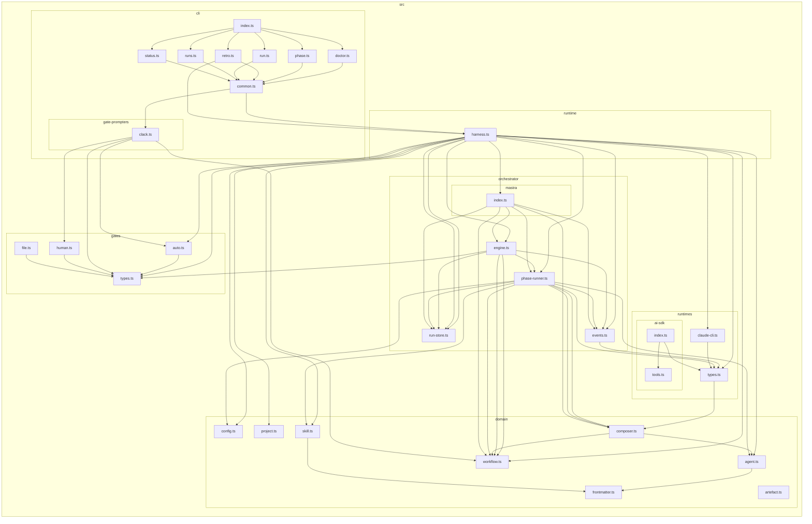

```mermaid
flowchart LR

subgraph 0["src"]
subgraph 1["cli"]
2["common.ts"]
subgraph Q["gate-prompters"]
R["clack.ts"]
end
T["doctor.ts"]
U["index.ts"]
V["phase.ts"]
W["retro.ts"]
X["run.ts"]
Y["runs.ts"]
Z["status.ts"]
end
subgraph 3["runtime"]
4["harness.ts"]
end
subgraph 5["domain"]
6["agent.ts"]
7["frontmatter.ts"]
8["config.ts"]
9["project.ts"]
A["skill.ts"]
B["workflow.ts"]
K["composer.ts"]
10["artefact.ts"]
end
subgraph C["gates"]
D["auto.ts"]
E["types.ts"]
S["human.ts"]
11["file.ts"]
end
subgraph F["orchestrator"]
G["engine.ts"]
H["events.ts"]
L["phase-runner.ts"]
M["run-store.ts"]
subgraph N["mastra"]
O["index.ts"]
end
end
subgraph I["runtimes"]
J["types.ts"]
P["claude-cli.ts"]
subgraph 12["ai-sdk"]
13["index.ts"]
14["tools.ts"]
end
end
end
2-->4
2-->R
4-->6
4-->8
4-->9
4-->A
4-->B
4-->D
4-->E
4-->G
4-->H
4-->O
4-->L
4-->M
4-->M
4-->P
4-->J
6-->7
A-->7
D-->E
G-->B
G-->B
G-->E
G-->H
G-->L
G-->M
H-->J
J-->K
K-->6
K-->B
L-->6
L-->K
L-->K
L-->8
L-->A
L-->B
L-->J
L-->H
L-->M
O-->K
O-->B
O-->G
O-->H
O-->L
O-->M
P-->J
R-->B
R-->D
R-->S
R-->E
S-->E
T-->2
U-->T
U-->V
U-->W
U-->X
U-->Y
U-->Z
V-->2
W-->4
W-->2
X-->2
Y-->2
Z-->2
11-->E
13-->J
13-->14
```
