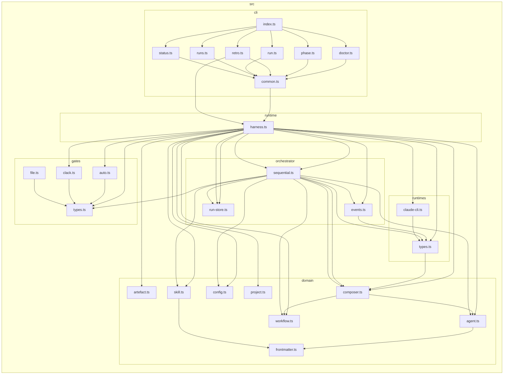

```mermaid
flowchart LR

subgraph 0["src"]
subgraph 1["cli"]
2["common.ts"]
P["doctor.ts"]
Q["index.ts"]
R["phase.ts"]
S["retro.ts"]
T["run.ts"]
U["runs.ts"]
V["status.ts"]
end
subgraph 3["runtime"]
4["harness.ts"]
end
subgraph 5["domain"]
6["agent.ts"]
7["frontmatter.ts"]
8["artefact.ts"]
9["composer.ts"]
A["workflow.ts"]
B["config.ts"]
C["project.ts"]
D["skill.ts"]
end
subgraph E["gates"]
F["auto.ts"]
G["types.ts"]
H["clack.ts"]
W["file.ts"]
end
subgraph I["orchestrator"]
J["events.ts"]
M["run-store.ts"]
N["sequential.ts"]
end
subgraph K["runtimes"]
L["types.ts"]
O["claude-cli.ts"]
end
end
2-->4
4-->6
4-->8
4-->9
4-->B
4-->C
4-->D
4-->A
4-->F
4-->H
4-->G
4-->J
4-->M
4-->M
4-->N
4-->N
4-->O
4-->L
6-->7
9-->6
9-->A
D-->7
F-->G
H-->G
J-->L
L-->9
N-->6
N-->9
N-->9
N-->B
N-->D
N-->A
N-->G
N-->L
N-->J
N-->M
O-->L
P-->2
Q-->P
Q-->R
Q-->S
Q-->T
Q-->U
Q-->V
R-->2
S-->4
S-->2
T-->2
U-->2
V-->2
W-->G
```
