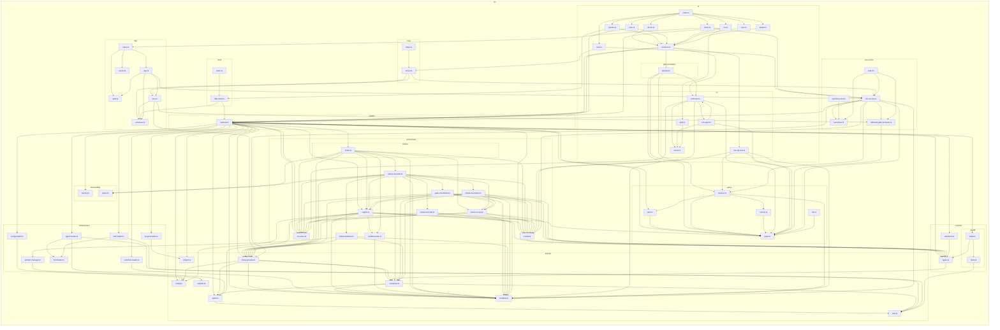

```mermaid
flowchart LR

subgraph 0["src"]
subgraph 1["cli"]
2["common.ts"]
subgraph 1B["gate-prompters"]
1C["opentui.ts"]
end
subgraph 1F["tui"]
1G["controller.ts"]
1H["run-app.tsx"]
1I["theme.ts"]
1J["non-tty-sink.ts"]
21["print.ts"]
end
1K["doctor.ts"]
1L["index.ts"]
1M["mcp.ts"]
1W["remote.ts"]
1Z["retro.ts"]
20["run.ts"]
22["runs.ts"]
23["serve.ts"]
28["status.ts"]
end
subgraph 3["runtime"]
4["harness.ts"]
end
subgraph 5["domain"]
6["agent.ts"]
7["skill.ts"]
8["config.ts"]
9["phase-preview.ts"]
A["composer.ts"]
B["workflow.ts"]
C["project.ts"]
14["artefact.ts"]
end
subgraph D["gates"]
E["auto.ts"]
F["types.ts"]
1D["resolver.ts"]
1E["human.ts"]
2A["file.ts"]
end
subgraph G["infrastructure"]
H["agent-loader.ts"]
I["frontmatter.ts"]
J["config-loader.ts"]
K["project-loader.ts"]
L["skill-loader.ts"]
M["workflow-loader.ts"]
13["artefact-manager.ts"]
end
subgraph N["observability"]
O["tracing.ts"]
Y["spans.ts"]
end
subgraph P["orchestrator"]
Q["engine.ts"]
T["events.ts"]
U["run-store.ts"]
V["workflow-plan.ts"]
subgraph W["mastra"]
X["index.ts"]
end
Z["phase-executor.ts"]
10["gate-coordinator.ts"]
11["phase-runner.ts"]
12["phase-artefacts.ts"]
15["phase-invocation.ts"]
16["phase-recorder.ts"]
end
subgraph R["runtimes"]
S["types.ts"]
subgraph 17["ai-sdk"]
18["index.ts"]
19["tools.ts"]
end
1A["claude-cli.ts"]
end
subgraph 1N["mcp"]
1O["server.ts"]
2B["index.ts"]
end
subgraph 1P["http"]
1Q["schemas.ts"]
1R["wire.ts"]
24["index.ts"]
25["app.ts"]
26["auth.ts"]
27["server.ts"]
end
subgraph 1S["run-service"]
1T["deferred-gate-prompter.ts"]
1U["run-service.ts"]
1V["event-bus.ts"]
2C["event-bus.test.ts"]
2D["index.ts"]
end
subgraph 1X["client"]
1Y["http-client.ts"]
29["index.ts"]
end
end
2-->4
2-->4
2-->1C
2-->1G
2-->1J
4-->6
4-->8
4-->9
4-->C
4-->B
4-->E
4-->F
4-->H
4-->J
4-->K
4-->L
4-->M
4-->O
4-->Q
4-->T
4-->X
4-->U
4-->U
4-->18
4-->1A
4-->S
6-->7
9-->6
9-->A
9-->A
9-->8
9-->B
A-->6
A-->7
A-->B
E-->F
H-->6
H-->7
H-->I
J-->8
K-->C
L-->7
L-->I
M-->B
Q-->6
Q-->8
Q-->9
Q-->B
Q-->F
Q-->S
Q-->T
Q-->U
Q-->V
S-->A
T-->S
V-->B
X-->9
X-->B
X-->Y
X-->Q
X-->T
X-->Z
X-->11
X-->U
X-->V
Z-->A
Z-->9
Z-->B
Z-->Y
Z-->Q
Z-->T
Z-->10
Z-->12
Z-->15
Z-->16
Z-->11
Z-->U
10-->A
10-->B
10-->S
10-->Q
10-->T
10-->11
10-->U
11-->9
11-->B
11-->S
11-->T
11-->U
12-->A
12-->9
12-->B
12-->13
13-->14
15-->A
15-->9
15-->B
15-->S
15-->Q
15-->T
15-->11
16-->B
16-->T
16-->U
18-->S
18-->19
19-->7
1A-->S
1C-->B
1C-->1D
1C-->F
1C-->1G
1D-->B
1D-->E
1D-->1E
1D-->F
1E-->F
1G-->F
1G-->T
1G-->U
1G-->1H
1G-->1I
1H-->F
1H-->1G
1H-->1I
1J-->B
1J-->1D
1J-->F
1J-->T
1K-->2
1L-->1K
1L-->1M
1L-->1W
1L-->1Z
1L-->20
1L-->22
1L-->23
1L-->28
1M-->1O
1M-->1U
1O-->1Q
1O-->1R
1O-->1U
1R-->9
1R-->1T
1R-->1Q
1T-->F
1U-->9
1U-->B
1U-->1D
1U-->F
1U-->T
1U-->4
1U-->1T
1U-->1V
1W-->1Y
1W-->2
1Y-->1Q
1Y-->4
1Z-->4
1Z-->2
20-->4
20-->2
20-->21
21-->1I
22-->2
23-->24
23-->1U
24-->25
24-->26
24-->27
25-->1U
25-->26
25-->1Q
25-->1R
28-->2
29-->1Y
2A-->F
2B-->1O
2C-->1V
2D-->1T
2D-->1V
2D-->1U
```
