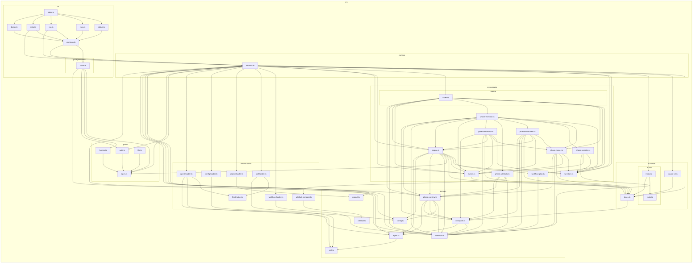

```mermaid
flowchart LR

subgraph 0["src"]
subgraph 1["cli"]
2["common.ts"]
subgraph 18["gate-prompters"]
19["clack.ts"]
end
1B["doctor.ts"]
1C["index.ts"]
1D["retro.ts"]
1E["run.ts"]
1F["runs.ts"]
1G["status.ts"]
end
subgraph 3["runtime"]
4["harness.ts"]
end
subgraph 5["domain"]
6["agent.ts"]
7["skill.ts"]
8["config.ts"]
9["phase-preview.ts"]
A["composer.ts"]
B["workflow.ts"]
C["project.ts"]
11["artefact.ts"]
end
subgraph D["gates"]
E["auto.ts"]
F["types.ts"]
1A["human.ts"]
1H["file.ts"]
end
subgraph G["infrastructure"]
H["agent-loader.ts"]
I["frontmatter.ts"]
J["config-loader.ts"]
K["project-loader.ts"]
L["skill-loader.ts"]
M["workflow-loader.ts"]
10["artefact-manager.ts"]
end
subgraph N["orchestrator"]
O["engine.ts"]
R["events.ts"]
S["run-store.ts"]
T["workflow-plan.ts"]
subgraph U["mastra"]
V["index.ts"]
end
W["phase-executor.ts"]
X["gate-coordinator.ts"]
Y["phase-runner.ts"]
Z["phase-artefacts.ts"]
12["phase-invocation.ts"]
13["phase-recorder.ts"]
end
subgraph P["runtimes"]
Q["types.ts"]
subgraph 14["ai-sdk"]
15["index.ts"]
16["tools.ts"]
end
17["claude-cli.ts"]
end
end
2-->4
2-->19
4-->6
4-->8
4-->9
4-->C
4-->B
4-->E
4-->F
4-->H
4-->J
4-->K
4-->L
4-->M
4-->O
4-->R
4-->V
4-->S
4-->S
4-->15
4-->17
4-->Q
6-->7
9-->6
9-->A
9-->A
9-->8
9-->B
A-->6
A-->B
E-->F
H-->6
H-->7
H-->I
J-->8
K-->C
L-->7
L-->I
M-->B
O-->6
O-->8
O-->9
O-->B
O-->F
O-->Q
O-->R
O-->S
O-->T
Q-->A
R-->Q
T-->B
V-->9
V-->B
V-->O
V-->R
V-->W
V-->Y
V-->S
V-->T
W-->A
W-->9
W-->B
W-->O
W-->R
W-->X
W-->Z
W-->12
W-->13
W-->Y
W-->S
X-->A
X-->B
X-->Q
X-->O
X-->R
X-->Y
X-->S
Y-->9
Y-->B
Y-->Q
Y-->R
Y-->S
Z-->A
Z-->9
Z-->B
Z-->10
10-->11
12-->A
12-->9
12-->B
12-->Q
12-->O
12-->R
12-->Y
13-->B
13-->R
13-->S
15-->Q
15-->16
17-->Q
19-->B
19-->E
19-->1A
19-->F
1A-->F
1B-->2
1C-->1B
1C-->1D
1C-->1E
1C-->1F
1C-->1G
1D-->4
1D-->2
1E-->4
1E-->2
1F-->2
1G-->2
1H-->F
```
