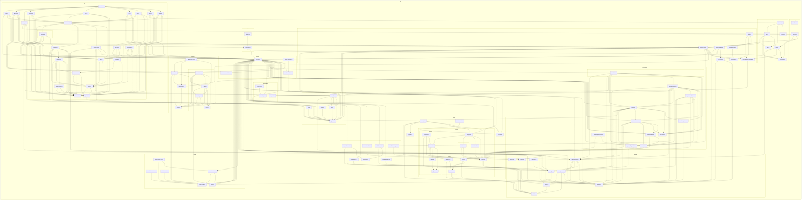

```mermaid
flowchart LR

subgraph 0["src"]
subgraph 1["broker"]
2["audit-chain.test.ts"]
3["audit-chain.ts"]
4["audit-service.test.ts"]
5["audit-service.ts"]
6["index.ts"]
7["broker.test.ts"]
end
subgraph 8["cli"]
9["audit.ts"]
21["common.ts"]
subgraph 22["gate-prompters"]
23["opentui.ts"]
end
subgraph 26["tui"]
27["controller.ts"]
28["format.ts"]
29["theme.ts"]
2A["types.ts"]
2B["run-app.tsx"]
2C["banner.tsx"]
2D["phase-visual.ts"]
2E["non-tty-sink.ts"]
2F["print.ts"]
2Z["dry-run.ts"]
30["preview.tsx"]
32["runs-table.tsx"]
end
2G["doctor.ts"]
2H["index.ts"]
2I["mcp.ts"]
2S["remote.ts"]
2V["retro.ts"]
2W["run.ts"]
31["runs.ts"]
33["serve.ts"]
38["status.ts"]
end
subgraph A["runtime"]
B["harness.ts"]
1Z["resolve-claude-bin.ts"]
20["worker-policy.ts"]
3H["worker-policy.test.ts"]
end
subgraph C["domain"]
D["agent.ts"]
E["skill.ts"]
F["config.ts"]
G["phase-preview.ts"]
H["composer.ts"]
I["workflow.ts"]
J["project.ts"]
1B["artefact.ts"]
3A["config.test.ts"]
end
subgraph K["gates"]
L["auto.ts"]
M["types.ts"]
24["resolver.ts"]
25["human.ts"]
3B["file.ts"]
end
subgraph N["infrastructure"]
O["agent-loader.ts"]
P["frontmatter.ts"]
Q["config-loader.ts"]
R["project-loader.ts"]
S["skill-loader.ts"]
T["workflow-loader.ts"]
1A["artefact-manager.ts"]
end
subgraph U["observability"]
V["tracing.ts"]
18["spans.ts"]
3D["tracing.test.ts"]
end
subgraph W["orchestrator"]
X["engine.ts"]
Y["events.ts"]
12["phase-runner.ts"]
13["run-store.ts"]
14["runtime-events.ts"]
15["workflow-plan.ts"]
subgraph 16["mastra"]
17["index.ts"]
end
19["phase-executor.ts"]
1C["gate-coordinator.ts"]
1D["phase-diagnostics.ts"]
3E["phase-diagnostics.test.ts"]
end
subgraph Z["worker"]
subgraph 10["runtimes"]
11["types.ts"]
1N["registry.ts"]
subgraph 1O["ai-sdk"]
1P["index.ts"]
1Q["tools.ts"]
end
subgraph 1R["shared"]
1S["tools.ts"]
1W["dispatcher.ts"]
end
1T["claude-cli.ts"]
subgraph 1U["scripted"]
1V["index.ts"]
1X["loader.ts"]
1Y["types.ts"]
3N["scripted.test.ts"]
end
end
1M["locator.ts"]
3K["entry.ts"]
3L["prepare.ts"]
3M["locator.test.ts"]
end
subgraph 1E["sandbox"]
1F["index.ts"]
1G["passthrough.ts"]
1H["types.ts"]
subgraph 1I["srt"]
1J["index.ts"]
1K["config.ts"]
1L["policy.ts"]
3J["srt.test.ts"]
end
3I["passthrough.test.ts"]
end
subgraph 2J["mcp"]
2K["server.ts"]
3C["index.ts"]
end
subgraph 2L["http"]
2M["schemas.ts"]
2N["wire.ts"]
34["index.ts"]
35["app.ts"]
36["auth.ts"]
37["server.ts"]
end
subgraph 2O["run-service"]
2P["deferred-gate-prompter.ts"]
2Q["run-service.ts"]
2R["event-bus.ts"]
2X["run-command.ts"]
2Y["run-seed.ts"]
3F["event-bus.test.ts"]
3G["index.ts"]
end
subgraph 2T["client"]
2U["http-client.ts"]
39["index.ts"]
end
end
2-->3
4-->3
4-->5
5-->3
5-->6
7-->6
9-->B
9-->21
9-->2F
9-->29
B-->6
B-->3
B-->3
B-->5
B-->D
B-->F
B-->G
B-->J
B-->I
B-->L
B-->M
B-->O
B-->Q
B-->R
B-->S
B-->T
B-->V
B-->X
B-->Y
B-->17
B-->12
B-->13
B-->13
B-->1F
B-->1H
B-->1M
B-->1N
B-->11
B-->1Z
B-->20
D-->E
F-->6
G-->D
G-->H
G-->H
G-->F
G-->I
H-->D
H-->E
H-->I
L-->M
O-->D
O-->E
O-->P
Q-->F
R-->J
S-->E
S-->P
T-->I
X-->D
X-->F
X-->G
X-->I
X-->M
X-->Y
X-->12
X-->13
X-->15
Y-->11
11-->H
12-->G
12-->I
12-->11
12-->Y
12-->13
12-->14
14-->11
14-->Y
15-->I
17-->G
17-->I
17-->18
17-->X
17-->Y
17-->19
17-->13
17-->15
19-->H
19-->G
19-->I
19-->1A
19-->18
19-->X
19-->Y
19-->1C
19-->1D
19-->12
19-->13
1A-->1B
1C-->H
1C-->I
1C-->11
1C-->X
1C-->Y
1C-->13
1D-->H
1D-->11
1F-->6
1F-->1G
1F-->1J
1F-->1H
1G-->1H
1J-->6
1J-->1H
1J-->1K
1J-->1L
1K-->1H
1K-->1L
1N-->1P
1N-->1T
1N-->1V
1N-->11
1P-->11
1P-->1Q
1Q-->E
1Q-->1S
1Q-->1S
1S-->E
1T-->11
1V-->1W
1V-->11
1V-->1X
1V-->1Y
1W-->E
1W-->1S
1X-->1Y
20-->1M
21-->B
21-->23
21-->27
21-->2E
21-->2A
23-->I
23-->24
23-->M
23-->27
24-->I
24-->L
24-->25
24-->M
25-->M
27-->M
27-->B
27-->28
27-->2B
27-->29
27-->2A
28-->29
28-->2A
2A-->M
2B-->M
2B-->2C
2B-->28
2B-->2D
2B-->29
2B-->2A
2C-->28
2C-->29
2C-->2A
2D-->29
2D-->2A
2E-->I
2E-->24
2E-->M
2E-->B
2E-->28
2F-->28
2F-->29
2G-->1Z
2G-->1F
2G-->21
2G-->2F
2G-->29
2H-->9
2H-->2G
2H-->2I
2H-->2S
2H-->2V
2H-->2W
2H-->31
2H-->33
2H-->38
2I-->2K
2I-->2Q
2I-->2F
2I-->29
2K-->2M
2K-->2N
2K-->2Q
2N-->G
2N-->2P
2N-->2M
2P-->M
2Q-->G
2Q-->I
2Q-->24
2Q-->M
2Q-->Y
2Q-->B
2Q-->1G
2Q-->2P
2Q-->2R
2S-->2U
2S-->21
2S-->2F
2S-->29
2U-->2M
2U-->B
2V-->B
2V-->21
2V-->2F
2V-->29
2W-->2X
2W-->B
2W-->21
2W-->2Z
2X-->I
2X-->B
2X-->2Y
2Y-->I
2Y-->I
2Z-->B
2Z-->30
2Z-->2F
30-->2C
30-->28
31-->B
31-->21
31-->2F
31-->32
31-->29
32-->B
32-->28
32-->2F
32-->29
33-->34
33-->2Q
33-->2F
33-->29
34-->35
34-->36
34-->37
35-->2Q
35-->36
35-->2M
35-->2N
38-->B
38-->21
38-->2F
38-->29
39-->2U
3A-->F
3B-->M
3C-->2K
3D-->V
3E-->11
3E-->1D
3F-->2R
3G-->2P
3G-->2R
3G-->2X
3G-->2Q
3H-->20
3I-->1F
3I-->1G
3I-->1J
3J-->1H
3J-->1K
3J-->1J
3J-->1L
3K-->G
3K-->I
3K-->3L
3K-->1N
3K-->11
3M-->1M
3N-->H
3N-->11
3N-->1V
```
