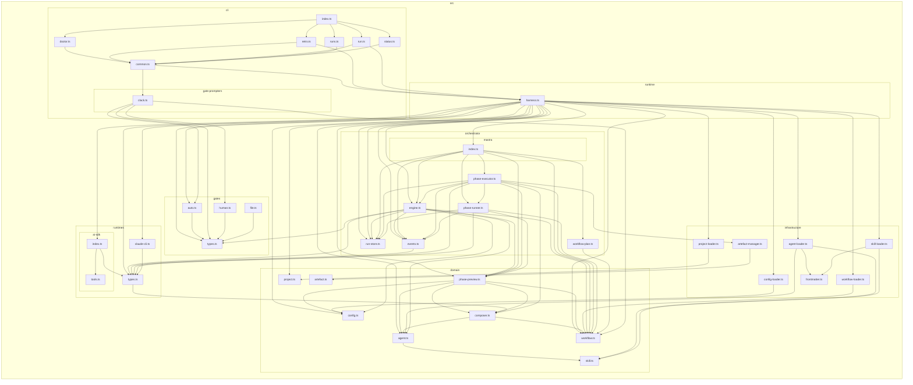

```mermaid
flowchart LR

subgraph 0["src"]
subgraph 1["cli"]
2["common.ts"]
subgraph 14["gate-prompters"]
15["clack.ts"]
end
17["doctor.ts"]
18["index.ts"]
19["retro.ts"]
1A["run.ts"]
1B["runs.ts"]
1C["status.ts"]
end
subgraph 3["runtime"]
4["harness.ts"]
end
subgraph 5["domain"]
6["agent.ts"]
7["skill.ts"]
8["config.ts"]
9["phase-preview.ts"]
A["composer.ts"]
B["workflow.ts"]
C["project.ts"]
X["artefact.ts"]
end
subgraph D["gates"]
E["auto.ts"]
F["types.ts"]
16["human.ts"]
1D["file.ts"]
end
subgraph G["infrastructure"]
H["agent-loader.ts"]
I["frontmatter.ts"]
J["config-loader.ts"]
K["project-loader.ts"]
L["skill-loader.ts"]
M["workflow-loader.ts"]
W["artefact-manager.ts"]
end
subgraph N["orchestrator"]
O["engine.ts"]
R["events.ts"]
S["run-store.ts"]
subgraph T["mastra"]
U["index.ts"]
end
V["phase-executor.ts"]
Y["phase-runner.ts"]
Z["workflow-plan.ts"]
end
subgraph P["runtimes"]
Q["types.ts"]
subgraph 10["ai-sdk"]
11["index.ts"]
12["tools.ts"]
end
13["claude-cli.ts"]
end
end
2-->4
2-->15
4-->6
4-->8
4-->9
4-->C
4-->B
4-->E
4-->F
4-->H
4-->J
4-->K
4-->L
4-->M
4-->O
4-->R
4-->U
4-->S
4-->S
4-->11
4-->13
4-->Q
6-->7
9-->6
9-->A
9-->A
9-->8
9-->B
A-->6
A-->B
E-->F
H-->6
H-->7
H-->I
J-->8
K-->C
L-->7
L-->I
M-->B
O-->6
O-->8
O-->9
O-->B
O-->F
O-->Q
O-->R
O-->S
Q-->A
R-->Q
U-->9
U-->B
U-->O
U-->R
U-->V
U-->Y
U-->S
U-->Z
V-->A
V-->9
V-->B
V-->W
V-->Q
V-->O
V-->R
V-->Y
V-->S
W-->X
Y-->9
Y-->B
Y-->Q
Y-->R
Y-->S
Z-->B
11-->Q
11-->12
13-->Q
15-->B
15-->E
15-->16
15-->F
16-->F
17-->2
18-->17
18-->19
18-->1A
18-->1B
18-->1C
19-->4
19-->2
1A-->4
1A-->2
1B-->2
1C-->2
1D-->F
```
