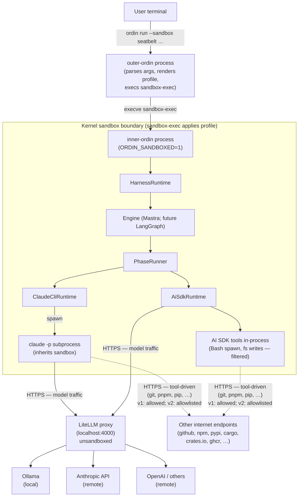
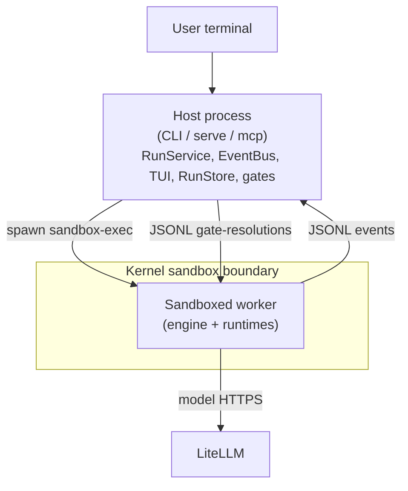

# Sandboxing — architecture diagram source

Diagram-source doc for ordin's v1 sandboxing architecture. Structured so it can be:

1. **Read directly** as text + Mermaid.
2. **Hand-authored into Excalidraw** by following the nodes / edges / boundary tables.
3. **Generated** by an Excalidraw-skill agent consuming this file.

For design rationale see [`decisions/sandboxing.md`](./decisions/sandboxing.md). For the implementation plan see [`sandboxing-implementation.md`](./sandboxing-implementation.md).

> **Step-1 addendum (L3a credential isolation, shipped):** the inner now reaches Langfuse through a parent-side `Broker` (`src/broker/`) wired as srt's `parentProxy`. Inner emits OTLP to `http://otel/...` via `HTTP_PROXY`; srt's allowlist gates first, then forwards approved egress to the broker on a localhost TCP port; the broker maps `otel` → `127.0.0.1:3000` and stamps `Authorization: Basic <pk:sk>` from credentials it holds parent-side. `LANGFUSE_*` is stripped from the inner's spawn env. The base diagram below describes the kernel-sandbox + srt baseline; the broker sits in the outer process between srt's HTTP proxy and the upstream Langfuse / LiteLLM containers. See [`sandboxing-implementation.md`](./sandboxing-implementation.md) for the L3a roadmap and [`sandboxing-findings.md`](./sandboxing-findings.md) for why we chose `parentProxy` over `mitmProxy`.

## Mermaid (in-repo preview)

Solid arrows = model traffic (consolidated at LiteLLM, one allowlist rule in v2). Dashed arrows = tool-driven egress (spawned `git`/`pnpm`/`pip`/etc. — many endpoints; v1 allows all, v2 allowlists per phase from `allowed_tools`).

## Nodes

| id | label | kind | description |
|---|---|---|---|
| `user-terminal` | User terminal | external | The shell session the user types `ordin run --sandbox seatbelt …` in. Must hold macOS Full Disk Access (TCC) for workspace paths under `~/Documents`/`~/Desktop`/`~/Downloads`/iCloud. |
| `outer-ordin` | outer-ordin process | process | First `ordin` invocation. Parses args + config, resolves workspace path, renders the sandbox profile with parameters substituted, sets `ORDIN_SANDBOXED=1`, calls `execve("sandbox-exec", […])`. Exists only momentarily before being replaced. |
| `kernel-sandbox` | Kernel sandbox boundary | boundary | The kernel applies the rendered `.sb` profile to this process and all descendants. Filters filesystem syscalls per the allow/deny rules; passes network through unchanged in v1. |
| `inner-ordin` | inner-ordin process | process | Post-`execve` invocation. Sees `ORDIN_SANDBOXED=1`, skips the re-exec branch, runs the harness logic. From the kernel's perspective, the same process tree as outer-ordin (PID may be the same depending on impl); from the userland's perspective, a fresh start of the harness logic. |
| `harness-runtime` | HarnessRuntime | module | `src/runtime/harness.ts`. The stable client seam. Loads workflow, agents, projects; selects engine; dispatches `startRun`. |
| `engine-mastra` | Engine (Mastra) | module | `src/orchestrator/mastra/`. Compiles the workflow plan and drives phase execution. Future engines (LangGraph) are siblings behind the `Engine` interface. |
| `phase-runner` | PhaseRunner | module | `src/orchestrator/phase-runner.ts`. Per-phase invocation; emits lifecycle events. |
| `claude-cli-runtime` | ClaudeCliRuntime | module | `src/runtimes/claude-cli.ts`. Wraps `spawn(claude -p)`; the subprocess contains the model's tool loop. |
| `claude-p-subproc` | claude -p subprocess | process | Spawned by ClaudeCliRuntime. Inherits the kernel sandbox automatically (no opt-out). Reads `~/.claude` (read-only) for Max-plan auth; writes transcripts under `~/.ordin/runs/<runId>/`. |
| `ai-sdk-runtime` | AiSdkRuntime | module | `src/runtimes/ai-sdk/`. Drives Vercel AI SDK against an OpenAI-compatible provider; the tool loop runs in-process inside the sandboxed bun process. |
| `tools-in-proc` | AI SDK tools (in-process) | module | `Bash` (spawns `/bin/sh` — sandboxed), `Read`/`Write`/`Edit` (direct fs syscalls — filtered), HTTP tools. Each constrained by the same profile as the parent process. |
| `litellm` | LiteLLM proxy | external | `localhost:4000` host process (typically docker-compose, unsandboxed). Routes *model* traffic to backends. v1 sandbox permits all egress; v2 egress allowlist will allow only `localhost:4000` for model traffic. |
| `ollama` | Ollama | external | Local model server. Runs entirely outside ordin's sandbox; the *agent* is sandboxed, the *model* is not (model execution is matrix-multiply, not tool execution — there is nothing to sandbox). |
| `anthropic-api` | Anthropic API | external | Remote provider. Reached only via LiteLLM in v2; in v1 reachable directly through unrestricted egress. |
| `other-providers` | OpenAI / others | external | Same shape as `anthropic-api`. |
| `other-internet` | Other internet endpoints | external | Everything reached by tool-driven egress: `github.com`, `registry.npmjs.org`, PyPI, crates.io, ghcr, language-specific CDNs, project-specific git remotes, etc. v1: all allowed. v2: allowlisted per phase, derived from each phase's `allowed_tools` declaration (e.g. `Bash(git fetch*)` → `github.com`; `Bash(pnpm install*)` → npm registry). |

## Edges

| from | to | label | kind |
|---|---|---|---|
| `user-terminal` | `outer-ordin` | `ordin run --sandbox seatbelt …` | invoke |
| `outer-ordin` | `inner-ordin` | execve sandbox-exec; sets `ORDIN_SANDBOXED=1` | execve |
| `inner-ordin` | `harness-runtime` | constructs | call |
| `harness-runtime` | `engine-mastra` | startRun → engine.run | call |
| `engine-mastra` | `phase-runner` | per phase | call |
| `phase-runner` | `claude-cli-runtime` | invoke (when phase runtime = claude-cli) | call |
| `phase-runner` | `ai-sdk-runtime` | invoke (when phase runtime = ai-sdk) | call |
| `claude-cli-runtime` | `claude-p-subproc` | spawn | spawn |
| `claude-p-subproc` | `kernel-sandbox` | inherits (descendant of inner-ordin) | inherits-sandbox |
| `ai-sdk-runtime` | `tools-in-proc` | tool loop (in-process) | call |
| `tools-in-proc` | `kernel-sandbox` | fs reads/writes filtered by profile | filtered |
| `claude-p-subproc` | `litellm` | HTTPS — model traffic | http (model) |
| `ai-sdk-runtime` | `litellm` | HTTPS — model traffic | http (model) |
| `claude-p-subproc` | `other-internet` | HTTPS — tool-driven (`git fetch`, `npm install`, etc.); v1 allowed, v2 per-phase allowlist | http (tool) |
| `tools-in-proc` | `other-internet` | HTTPS — tool-driven (`git fetch`, `npm install`, etc.); v1 allowed, v2 per-phase allowlist | http (tool) |
| `litellm` | `ollama` | HTTP | http (model) |
| `litellm` | `anthropic-api` | HTTPS | http (model) |
| `litellm` | `other-providers` | HTTPS | http (model) |

## Boundary groupings

- **Inside `kernel-sandbox`:** `inner-ordin`, `harness-runtime`, `engine-mastra`, `phase-runner`, `claude-cli-runtime`, `ai-sdk-runtime`, `claude-p-subproc`, `tools-in-proc`.
- **Outside `kernel-sandbox`:** `user-terminal`, `outer-ordin` (only momentarily), `litellm`, `ollama`, `anthropic-api`, `other-providers`, `other-internet`.

## Allow / deny annotations (call-outs near the boundary)

**Filesystem — read:**
- Allow: broad (root, system frameworks, user home).
- Deny: `~/.ssh`, `~/.aws`, `~/.gnupg`, `~/.netrc`, `~/.config/gh`, `~/.config/op`, `~/.config/1Password`, `~/Library/Application Support/{Google/Chrome, Firefox, Arc}`, `~/Library/Cookies`, `~/Library/Keychains`.
- Special: `~/.claude` allowed read-only (Claude Max-plan auth; cannot tamper).

**Filesystem — write:**
- Allow: workspace root, `~/.ordin/runs/<runId>`, per-process `$TMPDIR`.
- Deny: everything else.

**Network — two distinct lanes:**

| Lane | Traffic | v1 | v2 |
|---|---|---|---|
| Model | LLM requests (`claude -p` and AI SDK → LiteLLM) | allowed | allowed only to `localhost:4000` (LiteLLM consolidates all providers) |
| Tool-driven | Whatever spawned tools reach for: `git fetch`, `pnpm install`, `pip install`, `cargo fetch`, `gh api`, `curl`, etc. | allowed | per-phase allowlist derived from `allowed_tools` (e.g. `Bash(git fetch*)` → `github.com`; `Bash(pnpm install*)` → npm registry / mirror); phases without Bash → block all egress beyond LiteLLM |

In v1 both lanes are unrestricted. The diagram makes this explicit so the v1→v2 transition is visually obvious: solid model arrows tighten to "localhost only"; dashed tool arrows disappear for phases with no shell tools and tighten to a small allowlist for phases that need them.

## Layout hints (for Excalidraw)

- **Top-to-bottom flow** for the main path: user terminal at top, providers at bottom.
- **Sandbox boundary** rendered as a large rounded rectangle in the middle vertical band, labelled "Kernel sandbox (sandbox-exec)" along the top edge. Shaded interior (light grey/blue) to visually distinguish from outside-sandbox nodes.
- **Runtime-layer nodes** (ClaudeCliRuntime, AiSdkRuntime) side-by-side under PhaseRunner; their downstream subprocess/in-proc nodes also side-by-side.
- **LiteLLM** sits just below the sandbox boundary, slightly to the left; arrows from `claude-p-subproc` and `ai-sdk-runtime` cross the boundary downward (label "HTTPS — model traffic"). Solid arrows.
- **Other internet endpoints** sit at the same vertical level as LiteLLM but to the right. Arrows from `claude-p-subproc` and `tools-in-proc` cross the boundary downward into it. **Dashed** arrows, labelled "tool-driven (v1: allowed; v2: allowlisted per phase)" — visually distinguishes "model traffic always present" from "tool-driven traffic varies per phase."
- **Provider nodes** (Ollama, Anthropic, others) at the bottom-left, all reached via LiteLLM. A separator line above them helps emphasise these are external.
- **Allow / deny annotations** rendered as a side panel attached to the sandbox boundary's right edge — bullet list, no boxes.
- **Outer-ordin** rendered with a dashed outline + "transient" label; arrow to inner-ordin labelled "execve" with a thick arrow style. Optionally collapse outer-ordin into a small "boot" node since it disappears immediately.

## Optional second diagram: B-worker future variant (v2+)

Illustrative only — not v1. Shows the design path when the host needs to keep RunStore / TUI / gates outside the sandbox.

Key differences from v1 (B-process):

- Host process unsandboxed; engine in a sandboxed *child*.
- Gate prompter, RunStore writes, TUI rendering all on the host side.
- IPC: JSONL over stdio (or unix socket) for events outbound and gate resolutions inbound.
- Triggers for adopting B-worker: hosted/multi-tenant ordin; per-phase profiles where re-exec-per-phase is awkward; secrets the host holds that the agent should never see.

## Verification layer (not a runtime component)

The diagram shows the *runtime* architecture of a sandboxed run. Two additional artifacts exist to verify the architecture actually behaves as drawn:

- **Profile-level probes** (`src/sandbox/seatbelt/probes.ts` + `probes.test.ts`) — fast deterministic test that spawns `bash` under the rendered profile and asserts each `[probe, expected]` outcome. Catches profile bugs before merge.
- **Captive workflow** (`workflows/sandbox-probe.yaml` + `agents/sandbox-probe.md`) — LLM-driven agent that attempts documented escape categories and records outcomes in a report artefact. Surfaces escape vectors the fixed probe list missed.

Both run with `--sandbox seatbelt`. A clean run validates the diagram's allow / deny annotations actually hold. See ADR-011 in [`decisions/sandboxing.md`](./decisions/sandboxing.md) and Phase 6 in [`sandboxing-implementation.md`](./sandboxing-implementation.md).

## Cross-references

- ADR-001 (sandbox boundary), ADR-002 (~~broad-read + narrow-deny~~ — superseded by ADR-014), ADR-003 (single profile in v1), ADR-004 (macOS-only), ADR-005 (FS-only), ADR-006 (~/.claude), ADR-007 (passthrough default), ADR-008 (run-only), ADR-009 (env var), ADR-010 (phase boundary), ADR-011 (adversarial verification), ADR-014 (narrow-allow with system baseline; principle of least privilege). All in [`decisions/sandboxing.md`](./decisions/sandboxing.md).
- Implementation phases that materialise each part of this diagram: [`sandboxing-implementation.md`](./sandboxing-implementation.md).
